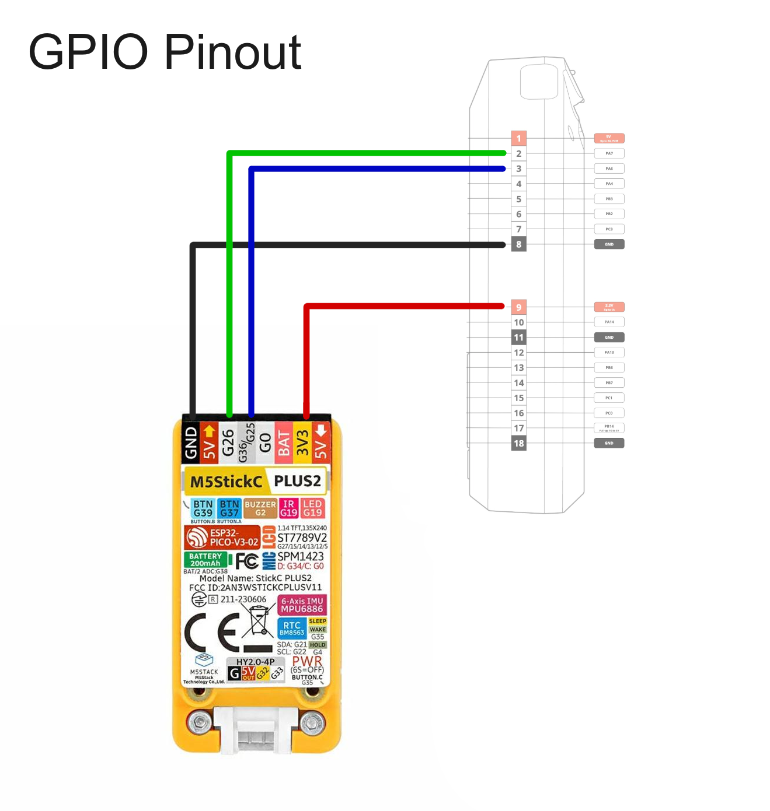

# ZeroStick Marauder 
**GPIO Nightmare Interface Between Flipper Zero and M5Stick C Plus**

  
*"When your Flipper dominates the Stick"*

## 🔥 Features
- **Cyber-secure** menu control via Flipper GPIO
- **Ghost protocol** activation
- [Marauder Link](https://github.com/justcallmekoko/ESP32Marauder)
- **Killer UI** with dynamic selector
- **One-click reboot** via side button

## 📡 Hardware Setup
| Flipper Zero       | M5Stick C Plus 2 |
|--------------------|------------------|
| A7 (Down)         →| G26          |
| A6 (Select)       →| G36          |
| GND               →| GND          |
| 3V3               →| 3V3         |

## ⚡ Installation
1. Flash the code to M5Stick:
bash
mpremote fs cp main.py :
2. Reset the device

## 💻 Code Structure
python
.
├── main.py                # Main firmware
├── docs/
│   ├── wiring.png         # Connection diagram
│   └── demo.gif           # Usage demo
└── LICENSE                # MIT License

## 🛠️ Customization
python
# Change these in main.py:
MENU_ITEMS = ["WIFI", "BLE", "IR"]  # Your menu options
FONT_SIZE = 16                       # 8-32 pixels
COLOR_SCHEME = 0x00ff00              # Matrix green

## ☠️ Warning 
diff
- THIS PROJECT IS FOR EDUCATIONAL PURPOSES ONLY -
- Use only in authorized testing environments  -
- The author denies any responsibility for misuse -

## 🪐 Community
Found a bug? Want to contribute?
- Open an **Issue**
- Submit a **Pull Request**

Made with ❤️ and 0xDEADBEEF by [YourName](https://github.com/yourprofile)
